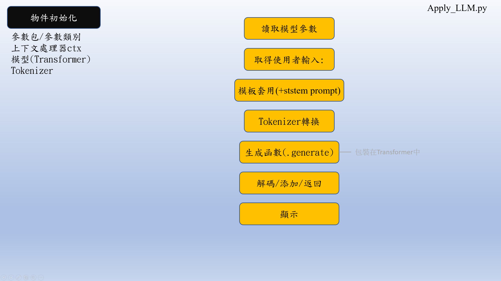

# MyLLM
create mini-LLM from scrap

# MyLLM 項目

## 項目介紹

[cite_start]本項目旨在重現 LLM 的實作流程，展示其架構、訓練過程以及各檔案之間的依賴關係，但不涉及原理說明 [cite: 1][cite_start]。對於想要深入研究的學習者，可以參考 Happy-LLM 專案或利用 GPT 來分析解構每個部件 [cite: 1][cite_start]。本專案簡化了 Happy-LLM 中的檔案，並將訓練資料的下載、預處理和分類都以 Python 呈現 [cite: 1][cite_start]。考慮到家用電腦的有限算力，專案也加入了接力訓練的設計，讓學習者可以透過串連零碎的時間來完成模型訓練 [cite: 1]。

專案內容涵蓋：
* [cite_start]Attention 機制 [cite: 1]
* [cite_start]Decoder Layer 組成 [cite: 1]
* [cite_start]Transformer 架構 [cite: 1]
* [cite_start]SFT 方法 [cite: 1]
* [cite_start]LLM 互動 [cite: 1]

## 使用說明

[cite_start]你只需要關注以下 6 個核心檔案，其他檔案都是由它們生成的 [cite: 1]。

1.  **Tokenizer_dataset_download.py**
    * [cite_start]自動下載預訓練與 SFT 所需的資料集（位於 `/dataset/tokenizer_data` 和 `/dataset/SFT`），並生成預處理版本 [cite: 1][cite_start]。原始版本用於訓練 Tokenizer，預處理版本則用於訓練模型 [cite: 1][cite_start]。總共會生成 4 個資料檔案 [cite: 1]。

2.  **BPE_Tokenizer.py**
    * [cite_start]根據資料集和自訂規則生成 `tokenizer.json`、`tokenizer_config.json` 和 `special_tokens_map.json` [cite: 1][cite_start]。這三個檔案是後續所有文本處理的基礎 [cite: 1]。

3.  **LLM_config.py**
    * [cite_start]紀錄 LLM 的配置設定、結構以及各類測試模組 [cite: 1]。

4.  **LLM_training.py**
    * [cite_start]將 `LLM_config` 中的模組串接起來進行訓練 [cite: 1][cite_start]。訓練過程中會生成 `/models/pretrain_1024_18_6144_stepxxxx.pth` 的模型檢查點，完成時會生成 `models/pretrain_1024_18_6144_final.pth` [cite: 1]。

5.  **SFT_training.py**
    * [cite_start]內容與 `LLM_training.py` 大致相同，主要差別在於使用的資料集和讀取的預訓練模型不同 [cite: 1][cite_start]。訓練過程同樣會生成檢查點及 `models/SFT_1024_18_6144_final.pth` [cite: 1]。

6.  **Apply_LLM.py**
    * [cite_start]用於讀取模型、進行測試、比較預訓練與 SFT 模型，並與你建立的 LLM 進行對話 [cite: 1]。

> [cite_start]`test.py`：(optional) 在預訓練前，用於確認 GPU 是否支援 [cite: 1][cite_start]。如果 GPU 不支援，建議先處理，不推薦使用 CPU 進行任何訓練 [cite: 1][cite_start]。若正確安裝 `requirements.txt`，GPU 會自然被支援 [cite: 1]。

### 快速開始

1.  **建立/啟動虛擬環境**
    * [cite_start]建議使用虛擬環境來避免與其他專案的套件版本發生衝突 [cite: 1]。

    ```bash
    python -m venv venv
    venv\Scripts\activate
    ```

2.  **安裝套件**
    * [cite_start]透過 `requirements.txt` 安裝所有必要的套件 [cite: 1]。

    ```bash
    pip install -r requirements.txt
    ```

3.  **下載/複製專案檔案**
    * [cite_start]使用 `git clone` 下載整個專案 [cite: 1]。

    ```bash
    git clone [https://github.com/Chiang1015/MyLLM.git](https://github.com/Chiang1015/MyLLM.git)
    ```

4.  **依序執行**
    * [cite_start]按照以下順序運行檔案，以完成模型訓練與對話 [cite: 1]。

    ```bash
    python Tokenizer_dataset_download.py
    python BPE_Tokenizer.py
    python LLM_training.py
    python SFT_training.py
    # 檢查模型是否已正確產生於 ./models/SFT_1024_18_6144_final.pth
    python Apply_LLM.py # 在終端中與你的 LLM 對話
    ```

## 架構介紹

1.  **Attention 機制**
    * [cite_start]採用 GQA + RoPE，這是 mini-LLM 中常見的做法 [cite: 1]。
    * 

2.  **MLP**
    * [cite_start]這是 LLM 中一個常有變動的小結構，這裡僅是一個範例 [cite: 1]。
    * 

3.  **Decoder Layer**
    * [cite_start]由 Attention + MLP + RMSNorm 組成的中型結構，是 Transformer 的基礎單位 [cite: 1]。
    * 

4.  **Transformer**
    * [cite_start]此處指 Decoder-only 版本，目前是主流架構 [cite: 1]。
    * 

5.  **Tokenizer**
    * [cite_start]這裡指產生三個主要檔案的流程，該流程相對自由，有許多可調整的順序 [cite: 1]。
    * 

6.  **訓練過程**
    * [cite_start]指 `LLM_training` 和 `SFT_training` 的流程 [cite: 1]。
    * 

7.  **應用模型**
    * [cite_start]初始化物件並載入模型參數，使用模板轉換文本後提交給模型，最後取得回傳 [cite: 1]。
    * 

## 更新方向

* [cite_start]LoRA 導入 [cite: 1]
* [cite_start]RAG 導入 [cite: 1]
* [cite_start]`Apply` 其他功能更新 [cite: 1]
